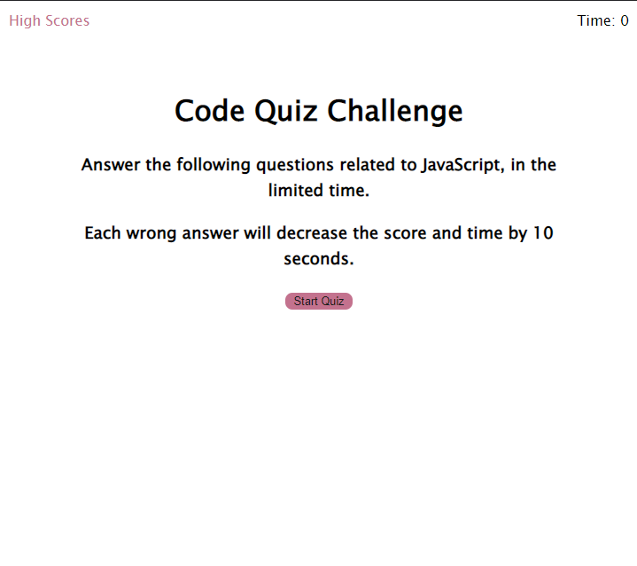
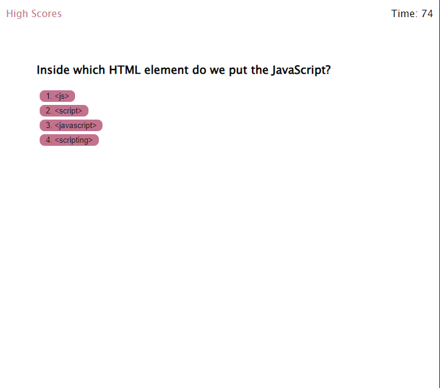
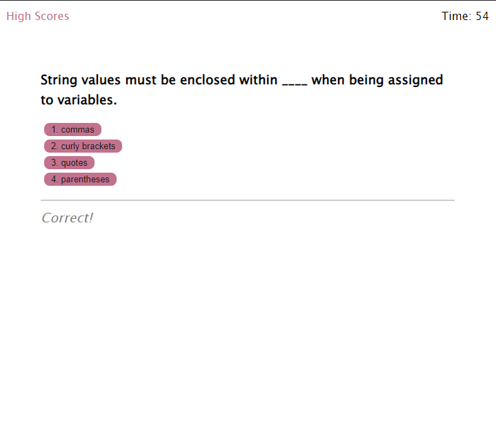
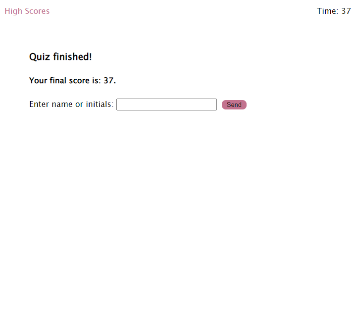
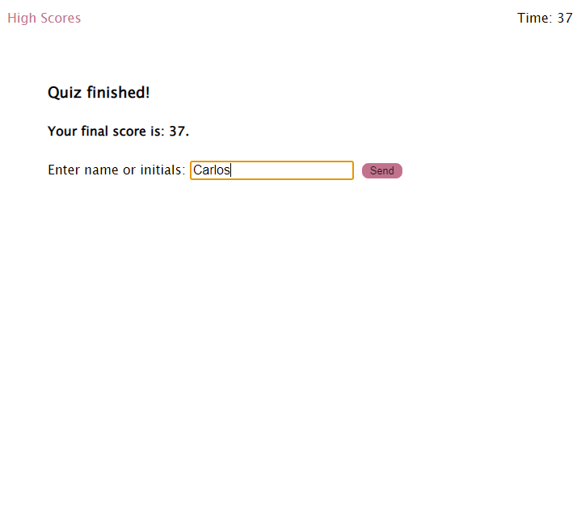
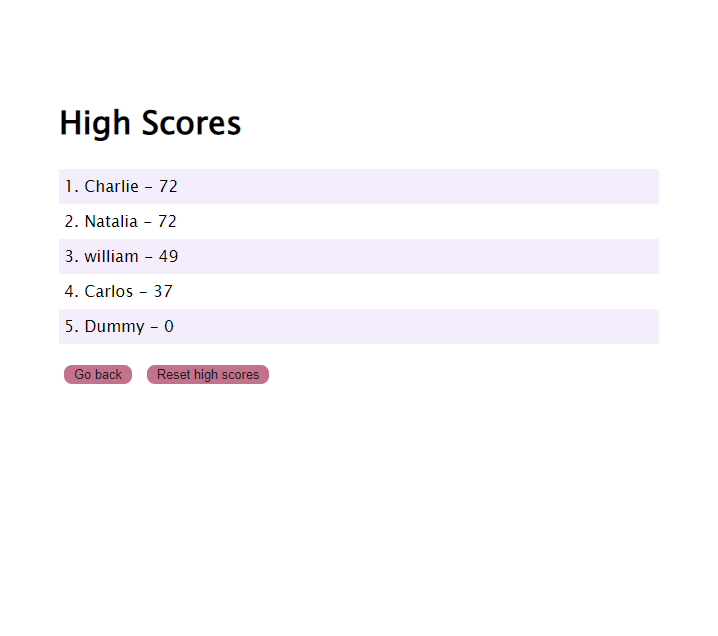

# web-apis-code-quiz 📓❔❗
Project that allows you to take a timed quiz on the fundamentals of JavaScript, which stores the highest scores. This allows you to measure your progress against previous attempts and against other users.

# Description ⭐📍
It is a website project that allows different users to take a quiz of 5 multiple choice questions about the fundamentals of JavaScript. The application saves in local storage the scores and the name/initials that the user registers at the end of the quiz.

This website arises from the need to test the knowledge about web APIs, as well as being able to inspect the object window, add styles to specific elements using setAttribute(), implement them using setInterval() and clearInterval(). Similarly, click events are handled using addEventListener(), and working with keyboard events like keyup.

As already mentioned, this web application stores data in the user's browser in localStorage, and converts an object to and from a JSON string by implementing JavaScript Object Notation methods. In the same way, it allows the elimination of the stored data on the client side.

# Functionality 💻❕

The application starts with its home screen presenting a screen that contains illustrative and indicative elements that it is a Code Quiz Challenge.✨

It presents the instructions on how to answer the quiz, and its rules, such as that there is a timer which is activated as soon as the "Start Quiz" button is clicked, and a stopwatch begins the countdown of 75 seconds, being penalized the user with 10 seconds for each wrong answer.🔒🔑

The timer is presented in the upper right corner, and the high scores query in the upper left corner.⌚

# 💡Application deployed 💡
* [Link](https://carlosgortiz.github.io/web-apis-code-quiz/) to web application. 
* [Link](https://github.com/carlosgortiz/web-apis-code-quiz) to remote repository. 

# 🏆🔧Application running 🔧🏆

